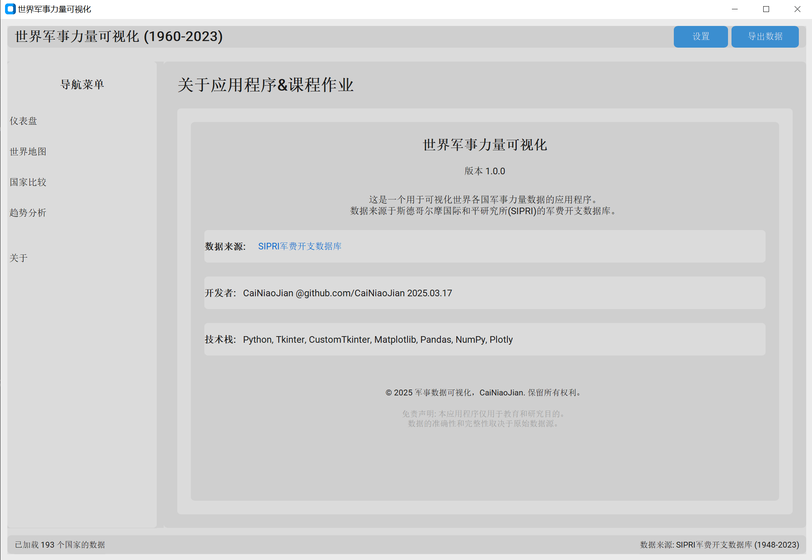
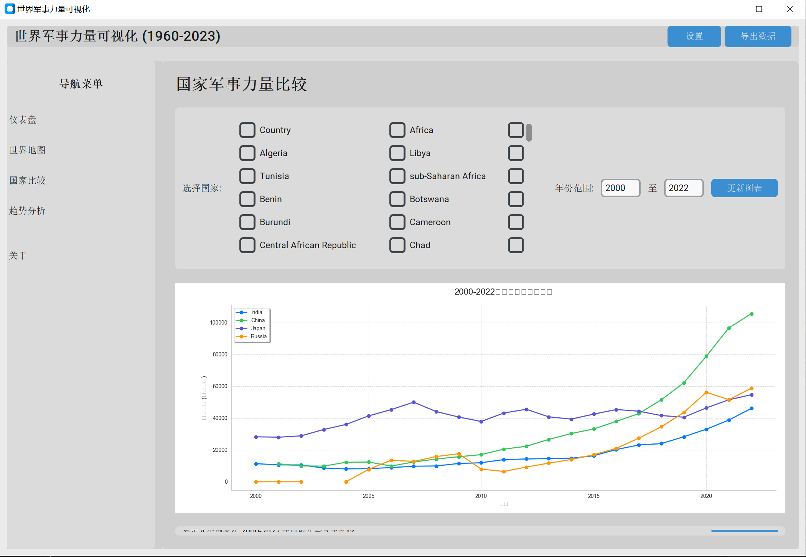
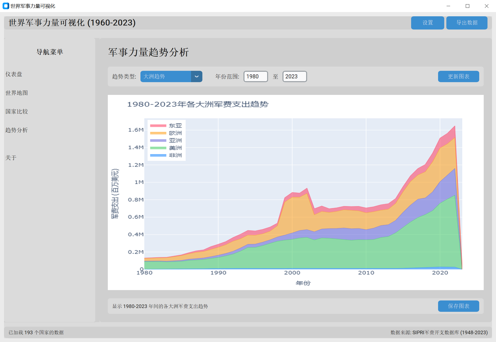

# This project uses Python to create visualizations from big data.🐆
# But empty！
## Hold some time..
### Here is Chinese version [CN.md](CN.md) (#ﾟДﾟ)
---
### Time for long lol /(ㄒoㄒ)/~~
Honestly, due to the lack of time, I didn't have much time to write shit.
But I will try my best to finish it in the future maybe.
### Deadline 3-4th week(#｀-_ゝ-)
- I have nothing learned yet.
- The job's target? No? Where? What? (・∀・(・∀・(・∀・*)
---
## Requirements:
1. Scientific: Introduce a real open-source dataset to reflect real-world situations
2. Technical: Python: GUI+Tkinter+Matplotlib+SQLite or Manim
3. Engineering: User-friendly installation, usage, and documentation
4. Desktop application
---
## tech

     


## Project Idea
## Military Power Visualization Application for Countries Worldwide (1960-2024)
This is a very interesting project idea for military fan! Creating a visualization application that displays changes in military power of countries worldwide from 1960 to 2024 perfectly meets your project requirements. Below are some specific suggestions:

## Data Sources
You can consider the following public data sources:

- Stockholm International Peace Research Institute (SIPRI) - provides military expenditure data
- Global Firepower Index - provides comprehensive military power rankings
- World Bank Open Data - provides related economic and population data
- Our World in Data - provides historical military data
- Uppsala Conflict Data Program - provides conflict data

## Visualization Solutions
1. Interactive World Map:
   
   - Use color depth to represent military strength
   - Click on countries to display detailed information

2. Timeline Slider:
   
   - Drag the slider to see changes in global military landscape across different years
   - Add a play button to automatically display animations of changes over time

3. Multi-dimensional Comparison Charts:
   
   - Bar charts comparing military expenditure of different countries
   - Radar charts comparing different dimensions of military power (army, navy, air force, etc.)
   - Line charts showing trends in military power over time

## 😊
### What should you do?

## Getting Started

### Environment Setup

1. Clone the repository:
```bash
git clone https://github.com/CaiNiaoJian/A-Python-based-big-data-visualization-project.git
cd A-Python-based-big-data-visualization-project

# Create virtual environment
python -m venv venv

# Activate virtual environment
# For Windows
venv\Scripts\activate
# For macOS/Linux
# source venv/bin/activate

# Upgrade pip to latest version
python -m pip install --upgrade pip

# Install required packages
pip install -r requirements.txt
```
### By the way, there are some packages should be installed out of the requirements.txt:
- PIL/Pillow
- openpyxl
- kaleido
- ttkthemes
- pyinstaller
- geopandas

### That's all.
<div align="center">
  
  
  
  
  
</div>

## Data
The SIPRI Military Expenditure Database includes data for 173 countries for the period 1949-2023. The database has been newly extended, having in the past only covered the period beginning in 1988. The availability of data over time nonetheless varies considerably by country. A majority of countries that existed at the time have data at least from the 1960s.

For information on the sources and methods for SIPRI data, including methods for calculating calendar year data from financial year data, for calculating constant price US$ figures, and for estimating missing data for countries as part of the world and regional totals, see https://www.sipri.org/databases/milex/sources-and-methods.

This workbook includes the following worksheets:

1) Estimates of world, regional and subregional totals in constant (2022) US$ (billions).
2) Data for military expenditure by country in current price local currency, presented according to each country's financial year.
3) Data for military expenditure by country in current price local currency, presented according to calendar year.
4) Data for military expenditure by country in constant price (2022) US$ (millions), presented according to calendar year, and in current US$m. for 2023.
5) Data for military expenditure by country in current US$ (millions), presented according to calendar year.
6) Data for military expenditure by country as a share of GDP, presented according to calendar year.
7) Data for military expenditure per capita, in current US$, presented according to calendar year. (1988-2023 only)
8) Data for military expenditure as a percentage of general government expenditure. (1988-2023 only)

The information in this document is the intellectual property of SIPRI. Under SIPRI's "fair use" policy, the data may be freely used for non-commercial purposes, including research, news reporting, comment, the production of educational materials that are not sold commercially, etc., provided that a) SIPRI is cited as the source of the data, with the citation: "SIPRI Military Expenditure Database 2024, https://www.sipri.org/databases/milex" and b) no more than 10% of the entire dataset is reproduced.

Any commercial use of the data (whether more or less than 10% of the dataset), or any reproduction of more than 10% of the entire dataset, requires specific permission from SIPRI, for which a fee will normally be charged based on the cost of generating the data. Contact milex@sipri.org for further information.

For the purpose of the above, 10% of the SIPRI Military Expenditure Database is defined to consist of 3,500 individual units of data, where a unit of data consists of a figure for military expenditure for one country in one year either in local currency at current prices (financial or calendar year), constant (2022) US$, current US$, or as a share of GDP, in each case together with relevant information contained in the bracketing, special note indicators and footnotes for that country and year; or an estimate of a world or regional total in constant (2022) US$ or current US$, together with the information contained in any bracketing for that figure.

```
src/
├── data/               # 数据处理模块
│   ├── data_loader.py  # 数据加载器
│   └── data_analyzer.py # 数据分析器
├── visualization/      # 可视化模块
│   └── visualizer.py   # 可视化器
├── utils/              # 工具模块
│   └── helpers.py      # 辅助函数
├── ui/                 # UI模块
│   ├── app.py          # 主应用程序类
│   └── components/     # UI组件
│       ├── sidebar.py  # 侧边栏
│       ├── dashboard.py # 仪表盘视图
│       ├── map_view.py # 世界地图视图
│       ├── comparison_view.py # 国家比较视图
│       ├── trend_view.py # 趋势分析视图
│       └── about_view.py # 关于视图
└── main.py             # 程序入口
```

## Error Handling and Fallback Mechanisms

This application implements a robust error handling system, particularly for the map visualization component which may face network-related challenges:

1. **Enhanced plotly_to_image Function**: 
   - Multi-layered error handling logic
   - Alternative rendering methods if the primary method fails
   - Fallback to informative error images rather than crashing

2. **Robust Map Visualization**: 
   - Try-except blocks to capture map rendering errors
   - Alternative visualizations when map creation fails:
     - Bar chart showing top 20 countries
     - Simple table view as a last resort

3. **User-Friendly Error Messages**:
   - Clear error messages explaining what happened
   - Suggestions for alternative views or solutions
   - Status updates guiding users through recovery options

When users encounter issues with the world map (e.g., errors loading `world_110m.json`), the application will:
1. First attempt standard choropleth map creation
2. If that fails, create a bar chart with the same data
3. If the bar chart fails, display a simple table
4. If all Plotly rendering fails, generate an image with an error message

This solution maintains code structure consistency while significantly improving application robustness.

**Note**: Successful use of the world map library requires network access to Plotly's CDN servers. As these servers are located internationally, users may need to configure network proxy settings for successful map loading in certain network environments.
